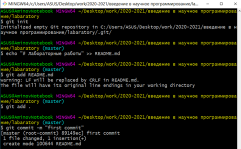
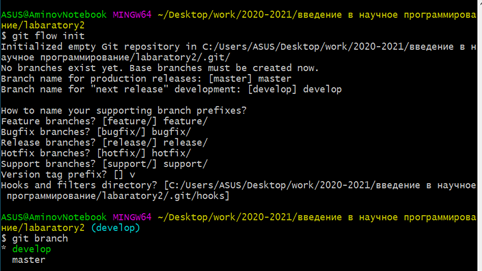

---
## Front matter
lang: ru-RU
title: Лабораторная работа №1
author: Аминов Зулфикор
institute: Российский Университет Дружбы Народов
date: 17 мая, 2022, Москва, Россия

## Formatting
mainfont: PT Serif
romanfont: PT Serif
sansfont: PT Sans
monofont: PT Mono
toc: false
slide_level: 2
theme: metropolis
header-includes: 
 - \metroset{progressbar=frametitle,sectionpage=progressbar,numbering=fraction}
 - '\makeatletter'
 - '\beamer@ignorenonframefalse'
 - '\makeatother'
aspectratio: 43
section-titles: true

---

# Цели и задачи работы

## Цель лабораторной работы

Изучение пространства git, применение раздичных команд и отработка эллементарных действий с системой.

## Задачи лабораторной работы

1. Создать учетную запись на github и репозиторий

2. Настроить репозиторий и создать файл для работы дальнейшей

3. Изучить механизм управления версиями и применить простые комманды

# Процесс выполнения лабораторной работы

## Создаем учетную запись на github.com и репозиторий, в котором в дальнейшем будем работать

{ #fig:001 width=100% height=100% }

## Инициализируем созданный нами локальный репозиторий, после создаем в нем файл README.md, с которым будем проводить все дальнейшие действия

{ #fig:006 width=100% height=100% }

## Инициализируем созданный нами локальный репозиторий, после создаем в нем файл README.md, с которым будем проводить все дальнейшие действия

{ #fig:007 width=100% height=100% }

## Создаем SSH-ключ, который пропишем в настройках на github.com

{ #fig:005 width=100% height=100% }

## Загружаем файлы лицензионного соглашения и gitignore и отправляем эти файлы в сетевой репозиторий.

{ #fig:008 width=100% height=100% }

## Используем системы управления версиями и тегами. Создаем ветку, начинаем и завершаем в ней релиз.

{ #fig:0015 width=100% height=100% }

## Используем систему управления версиями

{ #fig:0018 width=100% height=100% }

# Сделаем выводы по проделанной работе в лабораторной №1:

##

Мы приобрели практические навыки работы с системой контроля версий git и создали свой репозиторий. Изучили пространства git, применили различные команды и отработали эллементарные действий с системой.
