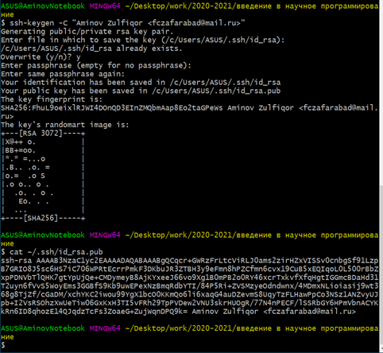

---
# Front matter
title: "Отчёт по лабораторной работе №1"
subtitle: "Работа с git"
author: "Аминов Зулфикор Мирзокаримович"

# Generic otions
lang: ru-RU
toc-title: "Содержание"

# Bibliography
bibliography: bib/cite.bib
csl: pandoc/csl/gost-r-7-0-5-2008-numeric.csl

# Pdf output format
toc: true # Table of contents
toc_depth: 2
fontsize: 12pt
linestretch: 1.5
papersize: a4
documentclass: scrreprt
## I18n
polyglossia-lang:
  name: russian
  options:
	- spelling=modern
	- babelshorthands=true
polyglossia-otherlangs:
  name: english
### Fonts
mainfont: PT Serif
romanfont: PT Serif
sansfont: PT Sans
monofont: PT Mono
mainfontoptions: Ligatures=TeX
romanfontoptions: Ligatures=TeX
sansfontoptions: Ligatures=TeX,Scale=MatchLowercase
monofontoptions: Scale=MatchLowercase,Scale=0.9
## Biblatex
biblatex: true
biblio-style: "gost-numeric"
biblatexoptions:
  - parentracker=true
  - backend=biber
  - hyperref=auto
  - language=auto
  - autolang=other*
  - citestyle=gost-numeric
## Misc options
indent: true
header-includes:
  - \linepenalty=10 # the penalty added to the badness of each line within a paragraph (no associated penalty node) Increasing the value makes tex try to have fewer lines in the paragraph.
  - \interlinepenalty=0 # value of the penalty (node) added after each line of a paragraph.
  - \hyphenpenalty=50 # the penalty for line breaking at an automatically inserted hyphen
  - \exhyphenpenalty=50 # the penalty for line breaking at an explicit hyphen
  - \binoppenalty=700 # the penalty for breaking a line at a binary operator
  - \relpenalty=500 # the penalty for breaking a line at a relation
  - \clubpenalty=150 # extra penalty for breaking after first line of a paragraph
  - \widowpenalty=150 # extra penalty for breaking before last line of a paragraph
  - \displaywidowpenalty=50 # extra penalty for breaking before last line before a display math
  - \brokenpenalty=100 # extra penalty for page breaking after a hyphenated line
  - \predisplaypenalty=10000 # penalty for breaking before a display
  - \postdisplaypenalty=0 # penalty for breaking after a display
  - \floatingpenalty = 20000 # penalty for splitting an insertion (can only be split footnote in standard LaTeX)
  - \raggedbottom # or \flushbottom
  - \usepackage{float} # keep figures where there are in the text
  - \floatplacement{figure}{H} # keep figures where there are in the text
---

# Цель работы

Изучение пространства git, применение раздичных команд и отработка эллементарных действий с системой.

# Выполнение работы

## Настройка git

{ #fig:001 width=100% height=100% }

{ #fig:002 width=100% height=100% }

{ #fig:003 width=100% height=100% }

{ #fig:004 width=100% height=100% }

{ #fig:005 width=100% height=100% }

## Подключение репозитория к github

{ #fig:006 width=100% height=100% }

{ #fig:007 width=100% height=100% }

{ #fig:008 width=100% height=100% }

{ #fig:009 width=100% height=100% }

{ #fig:0010 width=100% height=100% }

{ #fig:0011 width=100% height=100% }

## Первичная конфигурация

{ #fig:0011 width=100% height=100% }

{ #fig:0012 width=100% height=100% }

{ #fig:0013 width=100% height=100% }

{ #fig:0014 width=100% height=100% }

## Конфигурация git-flow

{ #fig:0015 width=100% height=100% }

{ #fig:0016 width=100% height=100% }

{ #fig:0017 width=100% height=100% }

{ #fig:0018 width=100% height=100% }

# Выводы

Приобрели практические навыки работы с системой контроля версий git и
создали свой репозиторий. Изучили пространства git, применили различные
команды и отработали эллементарные действий с системой.
