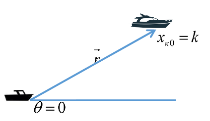
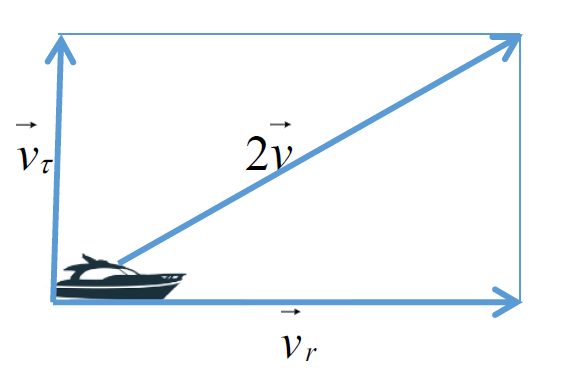
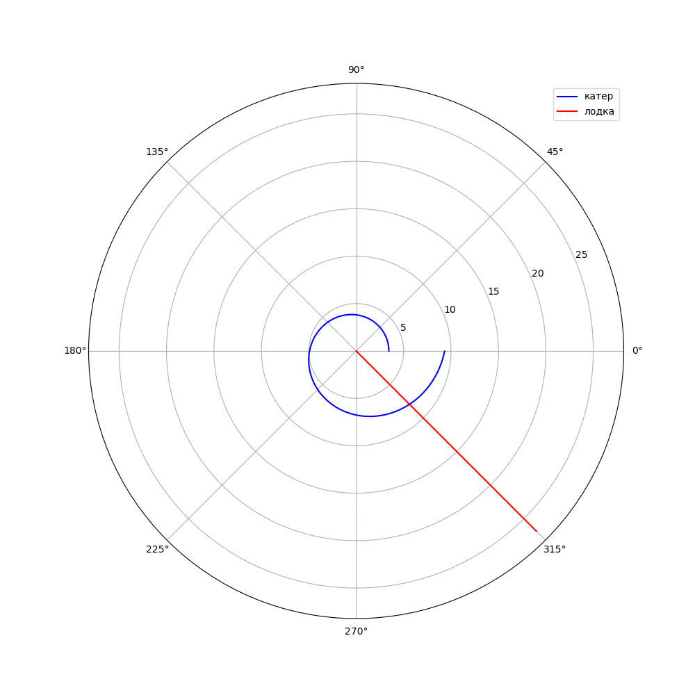
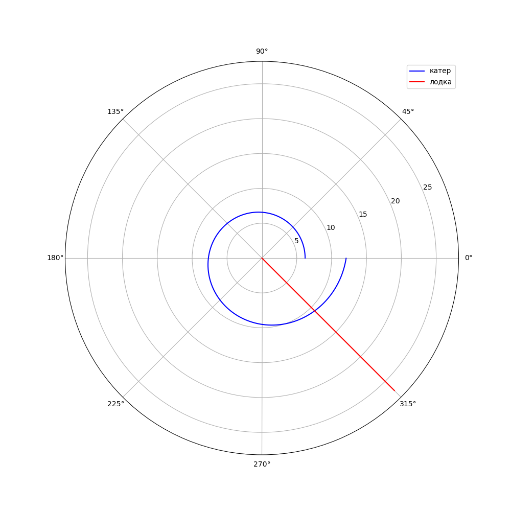

---
## Front matter
lang: ru-RU
title: Задача о погоне
author: |
	 Аминов Зулфикор\inst{1}

institute: |
	\inst{1}Российский Университет Дружбы Народов

date: 17.05, 2022, Москва, Россия

## Formatting
mainfont: PT Serif
romanfont: PT Serif
sansfont: PT Sans
monofont: PT Mono
toc: false
slide_level: 2
theme: metropolis
header-includes: 
 - \metroset{progressbar=frametitle,sectionpage=progressbar,numbering=fraction}
 - '\makeatletter'
 - '\beamer@ignorenonframefalse'
 - '\makeatother'
aspectratio: 43
section-titles: true

---

# Цели и задачи работы

## Цель лабораторной работы

Цель данной работы - научиться выполнять построения математических моделей для выбора правильной стратегии при решении задач поиска.

# Задание к лабораторной работе

## Задание

*Вариант 40*

На море в тумане катер береговой охраны преследует лодку браконьеров.
Через определенный промежуток времени туман рассеивается, и лодка
обнаруживается на расстоянии 15,5 км от катера. Затем лодка снова
скрывается в тумане и уходит прямолинейно в неизвестном направлении.
Известно, что скорость катера в 3,5 раза больше скорости браконьерской лодки.

## Задание

1. Запишите уравнение, описывающее движение катера, с начальными условиями
для двух случаев (в зависимости от расположения катера относительно лодки в
начальный момент времени).
2. Постройте траекторию движения катера и лодки для двух случаев.
3. Найдите точку пересечения траектории катера и лодки.

# Теоретический материал 

## Теоретический материал 

**Задача о погоне**

Приведем один из примеров построения математических моделей для
выбора правильной стратегии при решении задач поиска.

Например, рассмотрим задачу преследования браконьеров береговой
охраной. На море в тумане катер береговой охраны преследует лодку браконьеров.
Через определенный промежуток времени туман рассеивается, и лодка
обнаруживается на расстоянии *k* км от катера. Затем лодка снова скрывается в
тумане и уходит прямолинейно в неизвестном направлении. Известно, что скорость
катера в 2 раза больше скорости браконьерской лодки.

## Теоретический материал 

Необходимо определить по какой траектории необходимо двигаться катеру,
чтоб нагнать лодку.

## Теоретический материал 

**Постановка задачи**

1. Принимает за $t_0=0$, $x_l0=0$ - место нахождения лодки браконьеров в
момент обнаружения, $x_k0=0$ - место нахождения катера береговой охраны
относительно лодки браконьеров в момент обнаружения лодки.
2. Введем полярные координаты. Считаем, что полюс - это точка обнаружения
лодки браконьеров $x_l0$ $(Theta=x_l0=0)$, а полярная ось r проходит через точку
нахождения катера береговой охраны (рис. 5.1)

## Теоретический материал 

{ #fig:001 width=70% height=70% }

## Теоретический материал 

3. Траектория катера должна быть такой, чтобы и катер, и лодка все время
были на одном расстоянии от полюса $Theta$, только в этом случае траектория
катера пересечется с траекторией лодки.
Поэтому для начала катер береговой охраны должен двигаться некоторое
время прямолинейно, пока не окажется на том же расстоянии от полюса, что
и лодка браконьеров. После этого катер береговой охраны должен двигаться
вокруг полюса удаляясь от него с той же скоростью, что и лодка
браконьеров.

## Теоретический материал 

4. Чтобы найти расстояние x (расстояние после которого катер начнет
двигаться вокруг полюса), необходимо составить простое уравнение. Пусть
через время t катер и лодка окажутся на одном расстоянии x от полюса. За
это время лодка пройдет x , а катер *k-x* (или *k+x*, в зависимости от
начального положения катера относительно полюса). Время, за которое они
пройдут это расстояние, вычисляется как x/v или k-x/2v (во втором
случае x+k/2v). Так как время одно и то же, то эти величины одинаковы.
Тогда неизвестное расстояние x можно найти из следующего уравнения:
$$
x/v=k-x/2v
$$
в первом случае или

## Теоретический материал 

$$
x/v=x+k/2v
$$
во втором.

Отсюда мы найдем два значения $x_1=k/3$ и $x_2=k$, задачу будем
решать для двух случаев.

## Теоретический материал 

5. После того, как катер береговой охраны окажется на одном расстоянии от
полюса, что и лодка, он должен сменить прямолинейную траекторию и
начать двигаться вокруг полюса удаляясь от него со скоростью лодки v.
Для этого скорость катера раскладываем на две составляющие: $v_r$ -
радиальная скорость и $v_r$ - тангенциальная скорость (рис. 2).
Радиальная скорость - это скорость, с которой катер удаляется от полюса, $v_r=dr/dt$.
Нам нужно, чтобы эта скорость была равна скорости лодки, поэтому полагаем $dr/dt=v$.
Тангенциальная скорость – это линейная скорость вращения катера
относительно полюса. Она равна произведению угловой скорости $d*Theta/dt$ на
радиус r, $v_r=r*d*Theta/dt$

## Теоретический материал 

{ #fig:002 width=70% height=70% }

# Резузльтат работы

## Случай 1.

{ #fig:003 width=70% height=70% }

## Случай 1.

{ #fig:004 width=70% height=70% }

## Случай 2.

{ #fig:005 width=70% height=70% }

## Случай 2.

{ #fig:006 width=70% height=70% }

# Выводы по проделанной работе

## Вывод

Научился выполнять построения математических моделей для выбора правильной стратегии при решении задач поиска.

