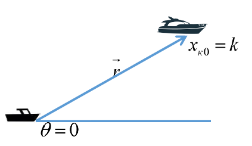
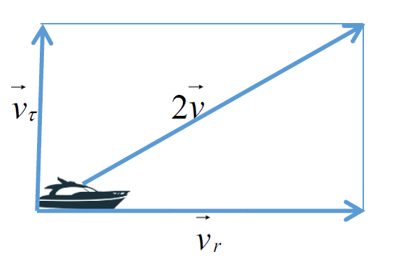
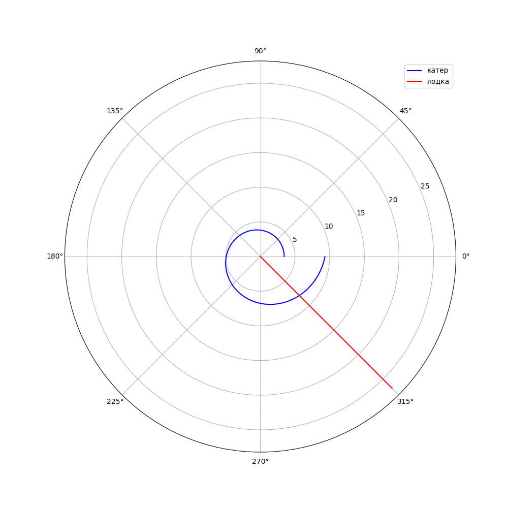
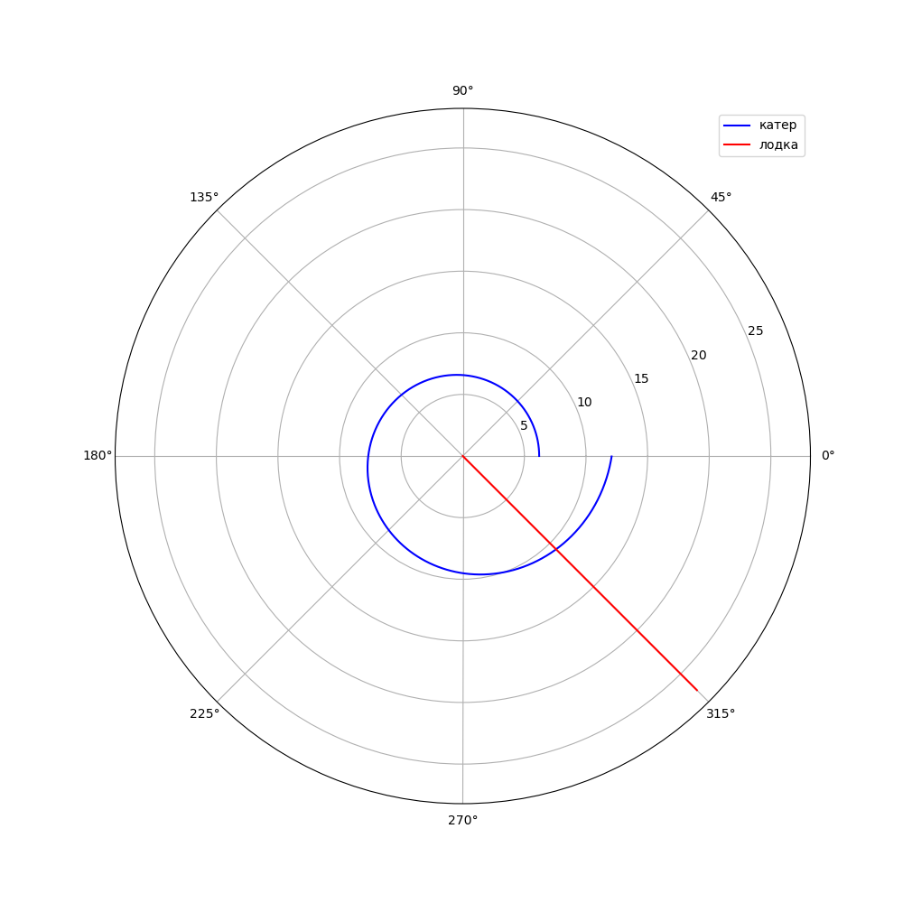

---
# Front matter
title: "Отчёт по лабораторной работе №2"
subtitle: "Вариант 40"
author: "Аминов Зулфикор Мирзокаримович"

# Generic otions
lang: ru-RU
toc-title: "Содержание"

# Bibliography
bibliography: bib/cite.bib
csl: pandoc/csl/gost-r-7-0-5-2008-numeric.csl

# Pdf output format
toc: true # Table of contents
toc_depth: 2
fontsize: 12pt
linestretch: 1.5
papersize: a4
documentclass: scrreprt
## I18n
polyglossia-lang:
  name: russian
  options:
	- spelling=modern
	- babelshorthands=true
polyglossia-otherlangs:
  name: english
### Fonts
mainfont: PT Serif
romanfont: PT Serif
sansfont: PT Sans
monofont: PT Mono
mainfontoptions: Ligatures=TeX
romanfontoptions: Ligatures=TeX
sansfontoptions: Ligatures=TeX,Scale=MatchLowercase
monofontoptions: Scale=MatchLowercase,Scale=0.9
## Biblatex
biblatex: true
biblio-style: "gost-numeric"
biblatexoptions:
  - parentracker=true
  - backend=biber
  - hyperref=auto
  - language=auto
  - autolang=other*
  - citestyle=gost-numeric
## Misc options
indent: true
header-includes:
  - \linepenalty=10 # the penalty added to the badness of each line within a paragraph (no associated penalty node) Increasing the value makes tex try to have fewer lines in the paragraph.
  - \interlinepenalty=0 # value of the penalty (node) added after each line of a paragraph.
  - \hyphenpenalty=50 # the penalty for line breaking at an automatically inserted hyphen
  - \exhyphenpenalty=50 # the penalty for line breaking at an explicit hyphen
  - \binoppenalty=700 # the penalty for breaking a line at a binary operator
  - \relpenalty=500 # the penalty for breaking a line at a relation
  - \clubpenalty=150 # extra penalty for breaking after first line of a paragraph
  - \widowpenalty=150 # extra penalty for breaking before last line of a paragraph
  - \displaywidowpenalty=50 # extra penalty for breaking before last line before a display math
  - \brokenpenalty=100 # extra penalty for page breaking after a hyphenated line
  - \predisplaypenalty=10000 # penalty for breaking before a display
  - \postdisplaypenalty=0 # penalty for breaking after a display
  - \floatingpenalty = 20000 # penalty for splitting an insertion (can only be split footnote in standard LaTeX)
  - \raggedbottom # or \flushbottom
  - \usepackage{float} # keep figures where there are in the text
  - \floatplacement{figure}{H} # keep figures where there are in the text
---

# Цель работы

Цель данной работы - научиться выполнять построения математических моделей для выбора правильной стратегии при решении задач поиска.

# Теоретическое введение

**Задача о погоне**

Приведем один из примеров построения математических моделей для
выбора правильной стратегии при решении задач поиска.

Например, рассмотрим задачу преследования браконьеров береговой
охраной. На море в тумане катер береговой охраны преследует лодку браконьеров.
Через определенный промежуток времени туман рассеивается, и лодка
обнаруживается на расстоянии *k* км от катера. Затем лодка снова скрывается в
тумане и уходит прямолинейно в неизвестном направлении. Известно, что скорость
катера в 2 раза больше скорости браконьерской лодки.

Необходимо определить по какой траектории необходимо двигаться катеру,
чтоб нагнать лодку.

**Постановка задачи**

1. Принимает за $t_0=0$, $x_l0=0$ - место нахождения лодки браконьеров в
момент обнаружения, $x_k0=0$ - место нахождения катера береговой охраны
относительно лодки браконьеров в момент обнаружения лодки.
2. Введем полярные координаты. Считаем, что полюс - это точка обнаружения
лодки браконьеров $x_l0$ $(Theta=x_l0=0)$, а полярная ось r проходит через точку
нахождения катера береговой охраны (рис. 5.1)

{ #fig:001 width=70% height=70% }

3. Траектория катера должна быть такой, чтобы и катер, и лодка все время
были на одном расстоянии от полюса $Theta$, только в этом случае траектория
катера пересечется с траекторией лодки.
Поэтому для начала катер береговой охраны должен двигаться некоторое
время прямолинейно, пока не окажется на том же расстоянии от полюса, что
и лодка браконьеров. После этого катер береговой охраны должен двигаться
вокруг полюса удаляясь от него с той же скоростью, что и лодка
браконьеров.
4. Чтобы найти расстояние x (расстояние после которого катер начнет
двигаться вокруг полюса), необходимо составить простое уравнение. Пусть
через время t катер и лодка окажутся на одном расстоянии x от полюса. За
это время лодка пройдет x , а катер *k-x* (или *k+x*, в зависимости от
начального положения катера относительно полюса). Время, за которое они
пройдут это расстояние, вычисляется как x/v или k-x/2v (во втором
случае x+k/2v). Так как время одно и то же, то эти величины одинаковы.
Тогда неизвестное расстояние x можно найти из следующего уравнения:
$$
x/v=k-x/2v
$$
в первом случае или
$$
x/v=x+k/2v
$$
во втором.

Отсюда мы найдем два значения $x_1=k/3$ и $x_2=k$, задачу будем
решать для двух случаев.
5. После того, как катер береговой охраны окажется на одном расстоянии от
полюса, что и лодка, он должен сменить прямолинейную траекторию и
начать двигаться вокруг полюса удаляясь от него со скоростью лодки v.
Для этого скорость катера раскладываем на две составляющие: $v_r$ -
радиальная скорость и $v_r$ - тангенциальная скорость (рис. 2).
Радиальная скорость - это скорость, с которой катер удаляется от полюса, $v_r=dr/dt$.
Нам нужно, чтобы эта скорость была равна скорости лодки, поэтому полагаем $dr/dt=v$.
Тангенциальная скорость – это линейная скорость вращения катера
относительно полюса. Она равна произведению угловой скорости $d*Theta/dt$ на
радиус r, $v_r=r*d*Theta/dt$

{ #fig:002 width=70% height=70% }

# Задание

*Вариант 40*

На море в тумане катер береговой охраны преследует лодку браконьеров.
Через определенный промежуток времени туман рассеивается, и лодка
обнаруживается на расстоянии 15,5 км от катера. Затем лодка снова
скрывается в тумане и уходит прямолинейно в неизвестном направлении.
Известно, что скорость катера в 3,5 раза больше скорости браконьерской лодки.

1. Запишите уравнение, описывающее движение катера, с начальными условиями
для двух случаев (в зависимости от расположения катера относительно лодки в
начальный момент времени).
2. Постройте траекторию движения катера и лодки для двух случаев.
3. Найдите точку пересечения траектории катера и лодки.

# Выполнение лабораторной работы и результат работы

**Код**

```
from math import *
import numpy as np
from scipy.integrate import odeint
import matplotlib.pyplot as plot

n=3.5 #(в 3,5 раза больше)
s=15.5 #(расстоянии 15,5 км)
fi=pi*3/4 #угол движения
def f(tetha, r): #уравнение катера
    dr=r/sqrt(n**2 - 1)
    return dr

def f2(t): #лодка браконьеров
    xt = tan(fi+pi)*t
    return xt
r0=s/(n+1) #первый случай

#решение диф уравнения для катера
tetha = np.arange(0, 2*pi, 0.01)
r = odeint(f, r0, tetha)

#вычисление траектории лодки
t=np.arange(0.00000000000001, 20)
r1=np.sqrt(t**2 + f2(t)**2)
tetha1=np.arctan(f2(t)/t)

plot.rcParams["figure.figsize"] = (10, 10)


plot.polar(tetha, r, 'blue', label = 'катер')
plot.polar(tetha1, r1, 'red', label = 'лодка')

#вычисление точки пересечения
tmp=0
for i in range(len(tetha)):
    if round(tetha[i], 2) == round(fi+pi, 2):
        tmp=i
print("Тета:", tetha[tmp], "r:", r[tmp][0])
print("X:", r[tmp][0]/sqrt(2), "Y:", -r[tmp][0]/sqrt(2))

plot.legend()
plot.savefig("01.png",dpi=100)
```

{ #fig:003 width=70% height=70% }

///

{ #fig:004 width=70% height=70% }

```
from math import *
import numpy as np
from scipy.integrate import odeint
import matplotlib.pyplot as plot

n=3.5 #(в 3,5 раза больше)
s=15.5 #(расстоянии 15,5 км)
fi=pi*3/4 #угол движения
def f(tetha, r): #уравнение катера
    dr=r/sqrt(n**2 - 1)
    return dr

def f2(t): #лодка браконьеров
    xt = tan(fi+pi)*t
    return xt
r0=s/(n-1) #второй случай

#решение диф уравнения для катера
tetha = np.arange(0, 2*pi, 0.01)
r = odeint(f, r0, tetha)

#вычисление траектории лодки
t=np.arange(0.00000000000001, 20)
r1=np.sqrt(t**2 + f2(t)**2)
tetha1=np.arctan(f2(t)/t)

plot.rcParams["figure.figsize"] = (10, 10)


plot.polar(tetha, r, 'blue', label = 'катер')
plot.polar(tetha1, r1, 'red', label = 'лодка')

#вычисление точки пересечения
tmp=0
for i in range(len(tetha)):
    if round(tetha[i], 2) == round(fi+pi, 2):
        tmp=i
print("Тета:", tetha[tmp], "r:", r[tmp][0])
print("X:", r[tmp][0]/sqrt(2), "Y:", -r[tmp][0]/sqrt(2))

plot.legend()
plot.savefig("02.png",dpi=100)
```

{ #fig:005 width=70% height=70% }

///

{ #fig:006 width=70% height=70% }


# Выводы

Научился выполнять построения математических моделей для выбора правильной стратегии при решении задач поиска.
