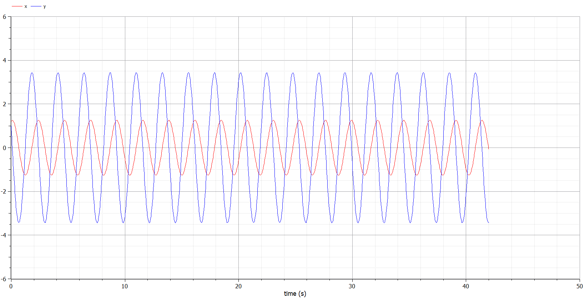
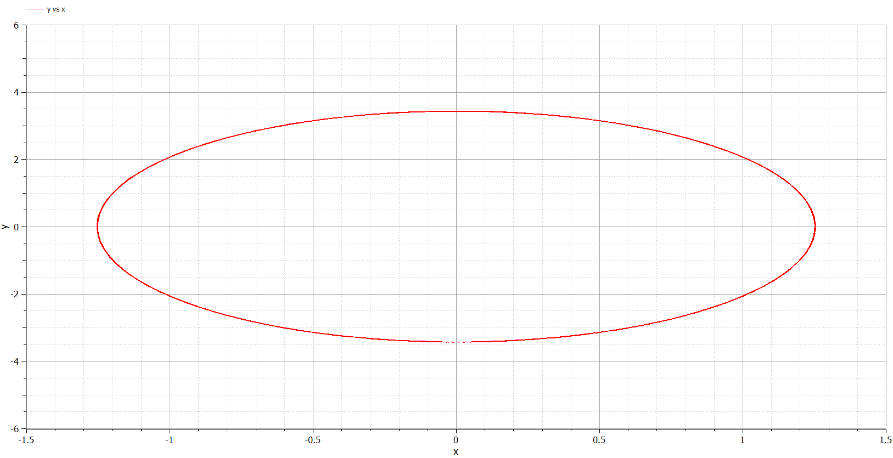
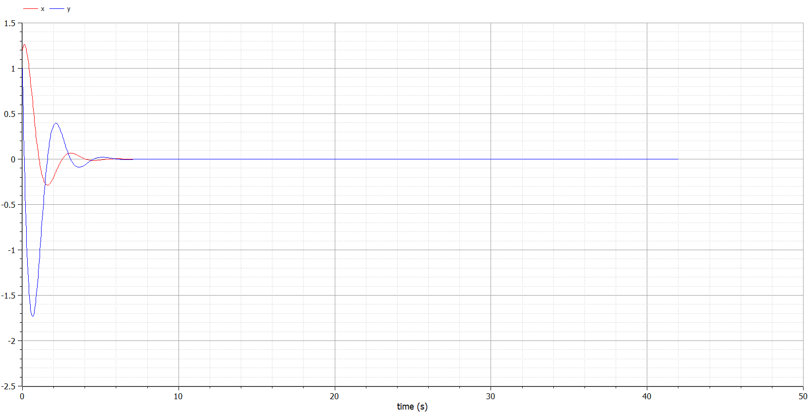
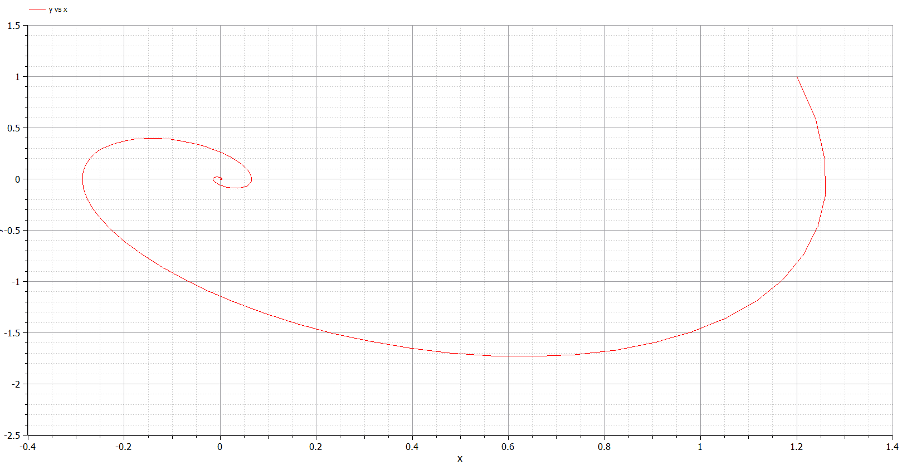
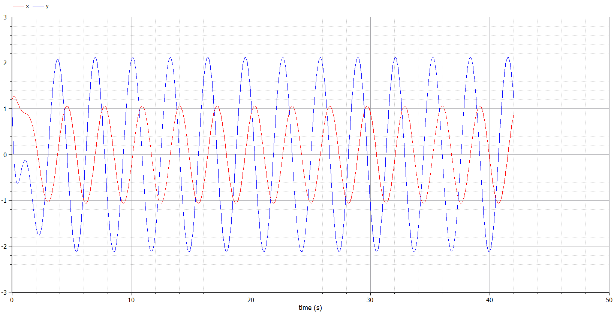
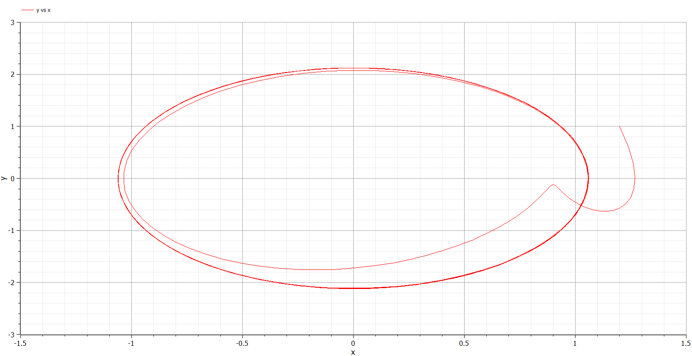

---
## Front matter
lang: ru-RU
title: Модель гармонических колебаний
author: |
	 Аминов Зулфикор\inst{1}

institute: |
	\inst{1}Российский Университет Дружбы Народов

date: 05 марта, 2022, Москва, Россия

## Formatting
mainfont: PT Serif
romanfont: PT Serif
sansfont: PT Sans
monofont: PT Mono
toc: false
slide_level: 2
theme: metropolis
header-includes: 
 - \metroset{progressbar=frametitle,sectionpage=progressbar,numbering=fraction}
 - '\makeatletter'
 - '\beamer@ignorenonframefalse'
 - '\makeatother'
aspectratio: 43
section-titles: true

---

# Цели и задачи работы

## Цель лабораторной работы

Построить график фазовый портрет гармонического осцилятора

## Задание к лабораторной работе

1. Построить решение уравнения гармонического осциллятора без затухания (2)
2. Записать уравнение свободных колебаний гармонического осциллятора с затуханием, построить его решение. Построить фазовый портрет гармонических колебаний с затуханием.
3. Записать уравнение колебаний гармонического осциллятора, если на систему действует внешняя сила, построить его решение. Построить фазовый портрет колебаний с действием внешней силы.

# Процесс выполнения лабораторной работы 

## Теоретический материал 

Движение грузика на пружинке, маятника, заряда в электрическом контуре, а также эволюция во времени многих систем в физике, химии, биологии и других науках при определенных предположениях можно описать одним и тем же дифференциальным уравнением, которое в теории колебаний выступает в качестве основной модели. Эта модель называется линейным гармоническим осциллятором.

Уравнение свободных колебаний гармонического осциллятора имеет следующий вид:
$$\ddot{x}+2\gamma\dot{x}+\omega_0^2=0$$

## Теоретический материал 

где $x$ - переменная, описывающая состояние системы (смещение грузика, заряд конденсатора и т.д.), $\gamma$ - параметр, характеризующий потери энергии (трение в механической системе, сопротивление в контуре), $\omega_0$ - собственная частота колебаний. t-время.
(Обозначения $$\ddot{x}=\frac{d^2x}{dt^2}, \dot{x}=\frac{dx}{dt}$$)

Уравнение (1) есть линейное однородное дифференциальное уравнение второго порядка и оно является примером линейной динамической системы.

## Теоретический материал 

При отсутствии потерь в системе ( $\gamma=0$ ) получаем уравнение консервативного осциллятора энергия колебания которого сохраняется во времени.
$$\ddot{x}+\omega_0^2x=0$$

Для однозначной разрешимости уравнения второго порядка необходимо задать два начальных условия вида
 
$$
 \begin{cases}
	x(t_0)=x_0
	\\   
	\dot{x(t_0)}=y_0
 \end{cases}
$$

## Теоретический материал 

Уравнение второго порядка (2) можно представить в виде системы двух уравнений первого порядка:
$$
 \begin{cases}
	\dot{x}=y
	\\   
	\dot{y}=-\omega_0^2x
 \end{cases}
$$

## Теоретический материал 

Начальные условия для системы примут вид:
$$
 \begin{cases}
	x(t_0)=x_0
	\\   
	y(t_0)=y_0
 \end{cases}
$$

## Теоретический материал 

Независимые	переменные	$x, y$	определяют	пространство,	в	котором «движется» решение. Это фазовое пространство системы, поскольку оно двумерно будем называть его фазовой плоскостью.

Значение фазовых координат $x, y$ в любой момент времени полностью определяет состояние системы. Решению уравнения движения как функции времени отвечает гладкая кривая в фазовой плоскости. Она называется фазовой траекторией. Если множество различных решений (соответствующих различным 
начальным условиям) изобразить на одной фазовой плоскости, возникает общая картина поведения системы. Такую картину, образованную набором фазовых траекторий, называют фазовым портретом.

## Вариант 40

Постройте фазовый портрет гармонического осциллятора и решение уравнения гармонического осциллятора для следующих случаев

1. Колебания гармонического осциллятора без затуханий и без действий внешней
силы $\ddot{x}+7.5x=0$
2. Колебания гармонического осциллятора c затуханием и без действий внешней
силы $\ddot{x}+2\dot{x}+5.5x=0$
3. Колебания гармонического осциллятора c затуханием и под действием внешней
силы $\ddot{x}+2.4\dot{x}+5x=5.2\sin{2t}$

На итнтервале $t \in [ 0;42 ]$, шаг 0.05, $x_0=1.2, y_0=1$

## Случай 1.

$\ddot{x}+7.5x=0$

{ #fig:003 width=70% height=70% }

{ #fig:003 width=70% height=70% }

## Случай 2.

$\ddot{x}+2\dot{x}+5.5x=0$

{ #fig:003 width=70% height=70% }

{ #fig:003 width=70% height=70% }

## Случай 3.

$\ddot{x}+2.4\dot{x}+5x=5.2\sin{2t}$

{ #fig:003 width=70% height=70% }

{ #fig:003 width=70% height=70% }

# Выводы по проделанной работе

## Вывод

Построили график фазовый портрет гармонического осцилятора

