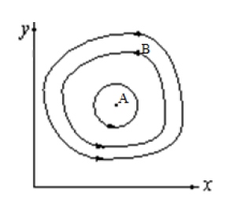
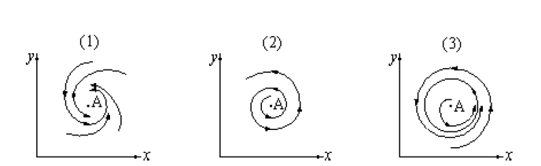
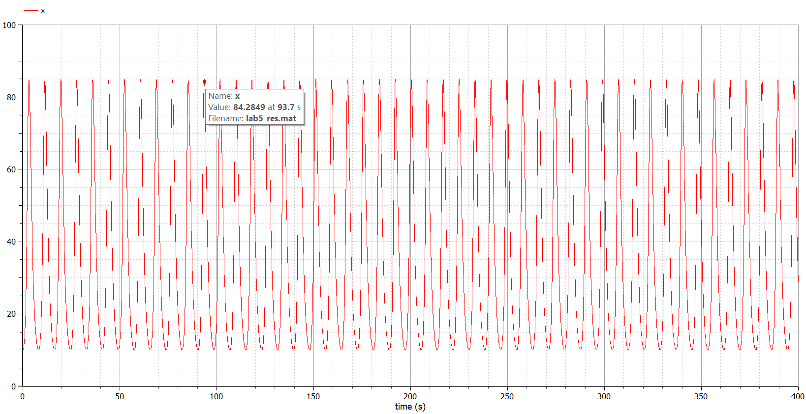
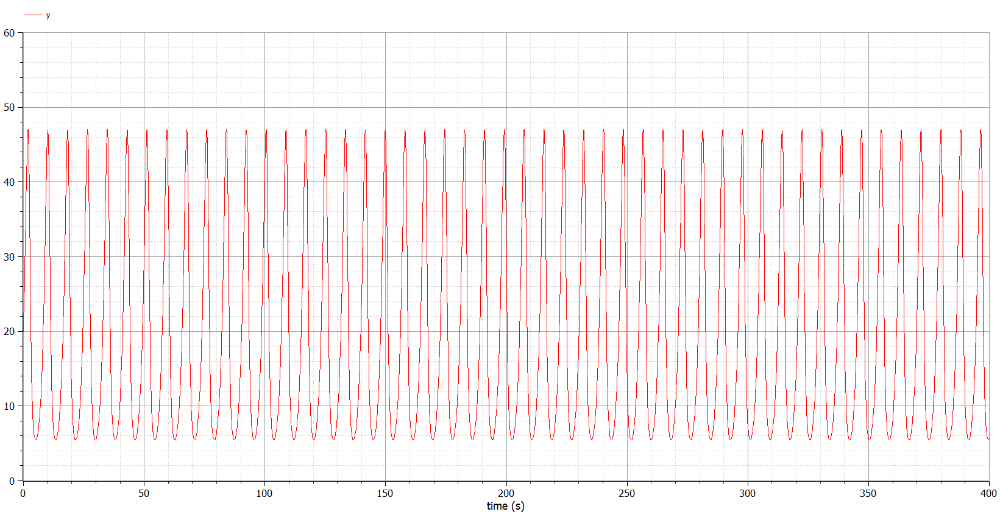
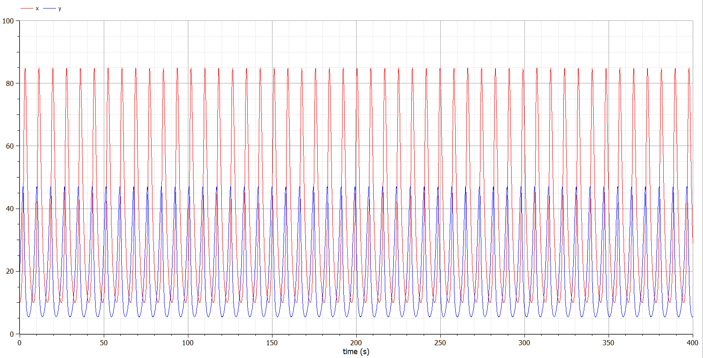
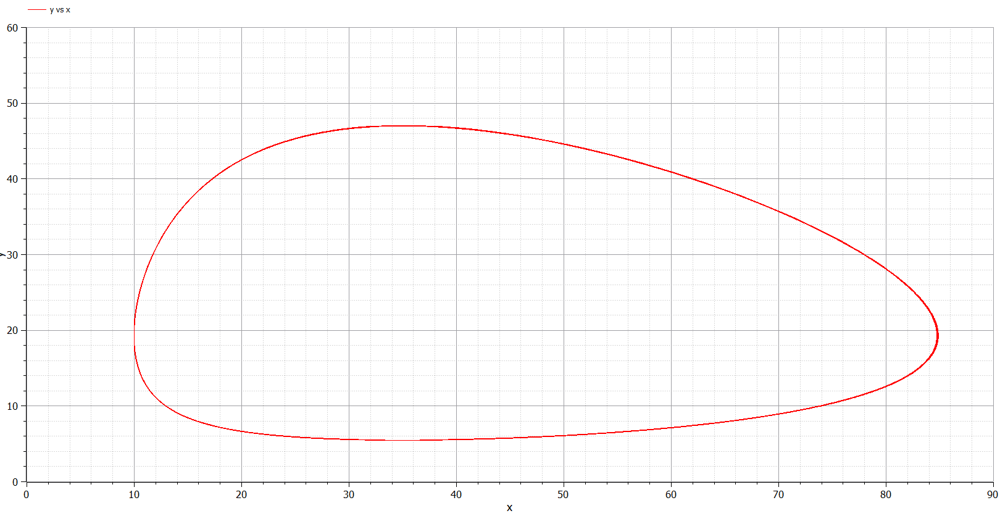
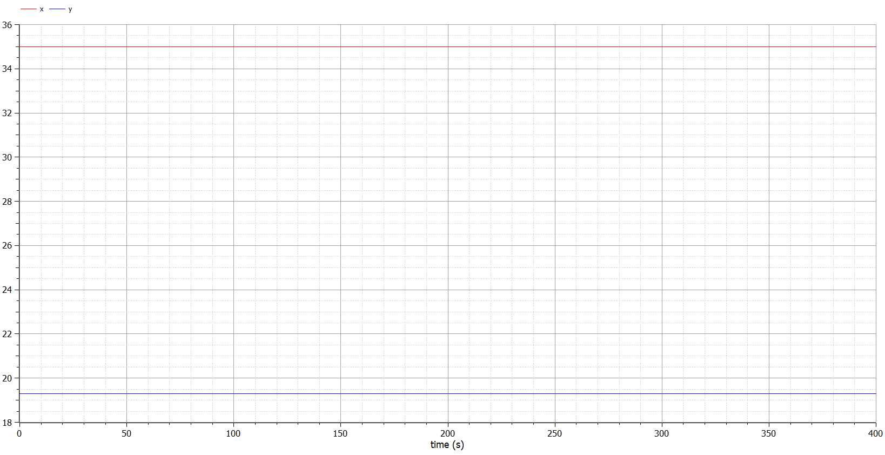

---
## Front matter
lang: ru-RU
title: Модель хищник-жертва
author: |
	 Аминов Зулфикор\inst{1}

institute: |
	\inst{1}Российский Университет Дружбы Народов

date: 12 марта, 2022, Москва, Россия

## Formatting
mainfont: PT Serif
romanfont: PT Serif
sansfont: PT Sans
monofont: PT Mono
toc: false
slide_level: 2
theme: metropolis
header-includes: 
 - \metroset{progressbar=frametitle,sectionpage=progressbar,numbering=fraction}
 - '\makeatletter'
 - '\beamer@ignorenonframefalse'
 - '\makeatother'
aspectratio: 43
section-titles: true

---

# Цели и задачи работы

## Цель лабораторной работы

Построение модели **Хищник-жертва**

## Задание к лабораторной работе

1. Построить график зависимости x от y и графики функций x(t), y(t)
2. Найти стационарное состояние системы

# Процесс выполнения лабораторной работы 

## Теоретический материал 

**Модель хищник-жертва**

Простейшая модель взаимодействия двух видов типа «хищник — жертва» -
**модель Лотки-Вольтерры**. Данная двувидовая модель основывается на
следующих предположениях:

## Теоретический материал 

1. Численность популяции жертв x и хищников y зависят только от времени (модель не учитывает пространственное распределение популяции на занимаемой территории)
2. В отсутствии взаимодействия численность видов изменяется по модели Мальтуса, при этом число жертв увеличивается, а число хищников падает
3. Естественная смертность жертвы и естественная рождаемость хищника считаются несущественными
4. Эффект насыщения численности обеих популяций не учитывается
5. Скорость роста численности жертв уменьшается пропорционально численности хищников

## Теоретический материал 

$$
 \begin{cases}
	\frac{dx}{dt} = -ax(t) + bx(t)y(t)
	\\   
	\frac{dy}{dt} = cy(t) - dx(t)y(t)
 \end{cases}
$$

В этой модели x – число жертв, y - число хищников. Коэффициент a
описывает скорость естественного прироста числа жертв в отсутствие хищников, с
- естественное вымирание хищников, лишенных пищи в виде жертв. Вероятность
взаимодействия жертвы и хищника считается пропорциональной как количеству
жертв, так и числу самих хищников (xy). Каждый акт взаимодействия уменьшает
популяцию жертв, но способствует увеличению популяции хищников (члены -bxy
и dxy в правой части уравнения).

## Теоретический материал 

{ #fig:001 width=70% height=70% }

Математический анализ этой (жесткой) модели показывает, что имеется
стационарное состояние (A на рис. 3.1), всякое же другое начальное состояние (B)
приводит к периодическому колебанию численности как жертв, так и хищников,
так что по прошествии некоторого времени система возвращается в состояние B.

## Теоретический материал 

Стационарное состояние системы (1) (положение равновесия, не зависящее
от времени решение) будет в точке: $x_0=\frac{c}{d}, y_0=\frac{a}{b},$ Если начальные значения
задать в стационарном состоянии $x(0)=x_0, y(0)=y_0$ , то в любой момент времени
численность популяций изменяться не будет. При малом отклонении от положения
равновесия численности как хищника, так и жертвы с течением времени не
возвращаются к равновесным значениям, а совершают периодические колебания
вокруг стационарной точки. Амплитуда колебаний и их период определяется
начальными значениями численностей x(0), y(0). Колебания совершаются в
противофазе.

## Теоретический материал 

При малом изменении модели

$$
 \begin{cases}
	\frac{dx}{dt} = -ax(t) + bx(t)y(t) + ef(x,y)
	\\   
	\frac{dy}{dt} = cy(t) - dx(t)y(t) + eg(x,y), e<<1
 \end{cases}
$$

## Теоретический материал 

(прибавление к правым частям малые члены, учитывающие, например,
конкуренцию жертв за пищу и хищников за жертв), вывод о периодичности
(возвращении системы в исходное состояние B), справедливый для жесткой
системы Лотки-Вольтерры, теряет силу. Таким образом, мы получаем так
называемую мягкую модель «хищник-жертва». В зависимости от вида малых
поправок f и g возможны следующие сценарии 1-3 рис. 3.2.

## Теоретический материал 

{ #fig:002 width=70% height=70% }

## Теоретический материал 

В случае 1 равновесное состояние A устойчиво. При любых других
начальных условиях через большое время устанавливается именно оно.

В случае 2 система стационарное состояние неустойчиво. Эволюция
приводит то к резкому увеличению числа хищников, то к их почти полному
вымиранию. Такая система в конце концов попадает в область столь больших или
столь малых значений x и y, что модель перестает быть применимой.

## Теоретический материал 

В случае 3 в системе с неустойчивым стационарным состоянием A с
течением времени устанавливается периодический режим. В отличие от исходной
жесткой модели Лотки-Вольтерры, в этой модели установившийся периодический
режим не зависит от начального условия. Первоначально незначительное
отклонение от стационарного состояния A приводит не к малым колебаниям около
A, как в модели Лотки-Вольтерры, а к колебаниям вполне определенной (и не
зависящей от малости отклонения) амплитуды. Возможны и другие структурно
устойчивые сценарии (например, с несколькими периодическими режимами).

## Теоретический материал 

Вывод: *жесткую модель всегда надлежит исследовать на структурную
устойчивость полученных при ее изучении результатов по отношению к малым
изменениям модели (делающим ее мягкой)*.

## Теоретический материал 

В случае модели Лотки-Вольтерры для суждения о том, какой же из
сценариев 1-3 (или иных возможных) реализуется в данной системе, совершенно
необходима дополнительная информация о системе (о виде малых поправок f и g в
нашей формуле). Математическая теория мягких моделей указывает, какую именно
информацию для этого нужно иметь. Без этой информации жесткая модель может
привести к качественно ошибочным предсказаниям. Доверять выводам, сделанным
на основании жесткой модели, можно лишь тогда, когда они подтверждаются
исследованием их структурной устойчивости.

## Вариант 40

Для модели «хищник-жертва»:

$$
 \begin{cases}
	\frac{dx}{dt} = -0.83x(t) + 0.043x(t)y(t)
	\\   
	\frac{dy}{dt} = 0.84y(t) - 0.024x(t)y(t)
 \end{cases}
$$

Постройте график зависимости численности хищников от численности жертв, а также графики изменения численности хищников и численности жертв при следующих начальных условиях: $x_0=10, y_0=20$.
Найдите стационарное состояние системы.

## Случай 1.

{ #fig:003 width=70% height=70% }

{ #fig:004 width=70% height=70% }

## Случай 1.

{ #fig:005 width=70% height=70% }

{ #fig:006 width=70% height=70% }

## Случай 2.

{ #fig:007 width=70% height=70% }

# Выводы по проделанной работе

## Вывод

Построили модели **Хищник-жертва** в OpenModelica

