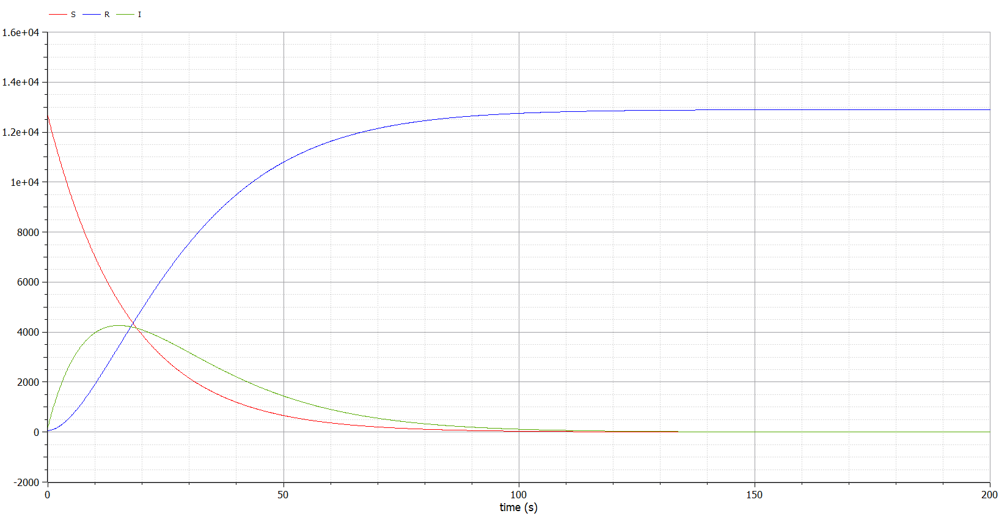

---
# Front matter
title: "Отчёт по лабораторной работе №6"
subtitle: "Вариант 40"
author: "Аминов Зулфикор Мирзокаримович"

# Generic otions
lang: ru-RU
toc-title: "Содержание"

# Bibliography
bibliography: bib/cite.bib
csl: pandoc/csl/gost-r-7-0-5-2008-numeric.csl

# Pdf output format
toc: true # Table of contents
toc_depth: 2
fontsize: 12pt
linestretch: 1.5
papersize: a4
documentclass: scrreprt
## I18n
polyglossia-lang:
  name: russian
  options:
	- spelling=modern
	- babelshorthands=true
polyglossia-otherlangs:
  name: english
### Fonts
mainfont: PT Serif
romanfont: PT Serif
sansfont: PT Sans
monofont: PT Mono
mainfontoptions: Ligatures=TeX
romanfontoptions: Ligatures=TeX
sansfontoptions: Ligatures=TeX,Scale=MatchLowercase
monofontoptions: Scale=MatchLowercase,Scale=0.9
## Biblatex
biblatex: true
biblio-style: "gost-numeric"
biblatexoptions:
  - parentracker=true
  - backend=biber
  - hyperref=auto
  - language=auto
  - autolang=other*
  - citestyle=gost-numeric
## Misc options
indent: true
header-includes:
  - \linepenalty=10 # the penalty added to the badness of each line within a paragraph (no associated penalty node) Increasing the value makes tex try to have fewer lines in the paragraph.
  - \interlinepenalty=0 # value of the penalty (node) added after each line of a paragraph.
  - \hyphenpenalty=50 # the penalty for line breaking at an automatically inserted hyphen
  - \exhyphenpenalty=50 # the penalty for line breaking at an explicit hyphen
  - \binoppenalty=700 # the penalty for breaking a line at a binary operator
  - \relpenalty=500 # the penalty for breaking a line at a relation
  - \clubpenalty=150 # extra penalty for breaking after first line of a paragraph
  - \widowpenalty=150 # extra penalty for breaking before last line of a paragraph
  - \displaywidowpenalty=50 # extra penalty for breaking before last line before a display math
  - \brokenpenalty=100 # extra penalty for page breaking after a hyphenated line
  - \predisplaypenalty=10000 # penalty for breaking before a display
  - \postdisplaypenalty=0 # penalty for breaking after a display
  - \floatingpenalty = 20000 # penalty for splitting an insertion (can only be split footnote in standard LaTeX)
  - \raggedbottom # or \flushbottom
  - \usepackage{float} # keep figures where there are in the text
  - \floatplacement{figure}{H} # keep figures where there are in the text
---

# Цель работы

Научиться строить модели эпидемии в OpenModelica.

# Теоретическое введение

**Задача об эпидемии**

$I(0) \leq I^*$ и  $I(0)>I^*$

Рассмотрим простейшую модель эпидемии. Предположим, что некая
популяция, состоящая из N особей, (считаем, что популяция изолирована)
подразделяется на три группы. Первая группа - это восприимчивые к болезни, но
пока здоровые особи, обозначим их через S(t). Вторая группа – это число
инфицированных особей, которые также при этом являются распространителями
инфекции, обозначим их I(t). А третья группа, обозначающаяся через R(t) – это
здоровые особи с иммунитетом к болезни.

До того, как число заболевших не превышает критического значения $I^*$,
считаем, что все больные изолированы и не заражают здоровых. Когда $I(t)>I^*$,
тогда инфицирование способны заражать восприимчивых к болезни особей.

Таким образом, скорость изменения числа S(t) меняется по следующему
закону:

$$
\frac{dS}{dt}=
 \begin{cases}
	-\alpha S &\text{,если $I(t) > I^*$}
	\\   
	0 &\text{,если $I(t) \leq I^*$}
 \end{cases}
$$

Поскольку каждая восприимчивая к болезни особь, которая, в конце концов,
заболевает, сама становится инфекционной, то скорость изменения числа
инфекционных особей представляет разность за единицу времени между
заразившимися и теми, кто уже болеет и лечится, т.е.:

$$
\frac{dI}{dt}=
 \begin{cases}
	\alpha S -\beta I &\text{,если $I(t) > I^*$}
	\\   
	-\beta I &\text{,если $I(t) \leq I^*$}
 \end{cases}
$$

А скорость изменения выздоравливающих особей (при этом приобретающие
иммунитет к болезни)

$$\frac{dR}{dt} = \beta I$$

Постоянные пропорциональности $\alpha, \beta$ - это коэффициенты заболеваемости и
выздоровления соответственно.

Для того, чтобы решения соответствующих уравнений
определялось однозначно, необходимо задать начальные условия. Считаем, что на начало
эпидемии в момент времени $t=0$ нет особей с иммунитетом к болезни $R(0)=0$, а число
инфицированных и восприимчивых к болезни особей $I(0)$ и $S(0)$ соответственно. Для
анализа картины протекания эпидемии необходимо рассмотреть два случая:  $I(0) \leq I^*$ и  $I(0)>I^*$

# Задание
Придумайте свой пример задачи об эпидемии, задайте начальные условия и
коэффициенты пропорциональности. Постройте графики изменения числа особей в
каждой из трех групп. Рассмотрите, как будет протекать эпидемия в случае:

а)	$I(0)\leq I^*$

б)	$I(0)>I^*$

# Вариант 40
На одном острове вспыхнула эпидемия. Известно, что из всех проживающих
на острове (N=12 900) в момент начала эпидемии (t=0) число заболевших людей
(являющихся распространителями инфекции) I(0)=190, А число здоровых людей с
иммунитетом к болезни R(0)=59. Таким образом, число людей восприимчивых к
болезни, но пока здоровых, в начальный момент времени S(0)=N-I(0)- R(0).

Постройте графики изменения числа особей в каждой из трех групп.
Рассмотрите, как будет протекать эпидемия в случае:

1)	$I(0)\leq I^*$

2)	$I(0)>I^*$

# Выполнение лабораторной работы и результат работы

**Код 1**

```
model lab6_a
  parameter  Real a=0.059;
  parameter  Real b=0.072;
  

  Real I(start=190);
  Real R(start=59);  
  Real S(start=12651);
  
  equation
    der(S) = 0;
    der(I) = -b*I;
    der(R) = b*I;

end lab6_a;

```

{ #fig:003 width=70% height=70% }

**Код 2**

```
model lab6_b
  parameter  Real a=0.059;
  parameter  Real b=0.072;
  

  Real I(start=190);
  Real R(start=59);  
  Real S(start=12651);

  equation
    der(S) = -a*S;
    der(I) = a*S-b*I;
    der(R) = b*I;

end lab6_b;

```

{ #fig:007 width=70% height=70% }


# Выводы

Познакомились с задачей об эпидемии и построили графики.
