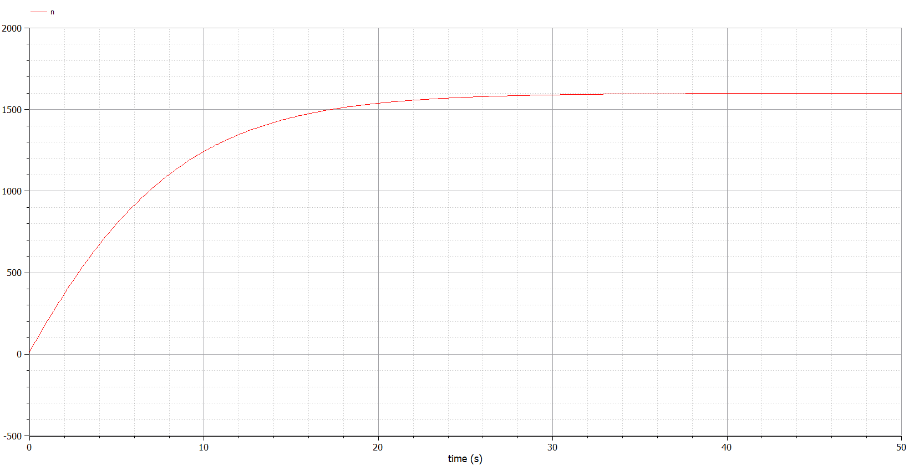

---
## Front matter
lang: ru-RU
title: Эффективность рекламы
author: |
	 Аминов Зулфикор\inst{1}

institute: |
	\inst{1}Российский Университет Дружбы Народов

date: 26 марта, 2022, Москва, Россия

## Formatting
mainfont: PT Serif
romanfont: PT Serif
sansfont: PT Sans
monofont: PT Mono
toc: false
slide_level: 2
theme: metropolis
header-includes: 
 - \metroset{progressbar=frametitle,sectionpage=progressbar,numbering=fraction}
 - '\makeatletter'
 - '\beamer@ignorenonframefalse'
 - '\makeatother'
aspectratio: 43
section-titles: true

---

# Цели и задачи работы

## Цель лабораторной работы

Изучение задачи об эффективности рекламы.

# Задание к лабораторной работе

## Задание

1. Построить график распространения рекламы о салоне красоты ($N_0$ и $N$-задайте самостоятельно).
2. Сравнить эффективность рекламной кампании при $\alpha _1(t) > \alpha _2(t)$ и $\alpha _1(t) < \alpha _2(t)$
3. Определить в какой момент времени эффективность рекламы будет иметь максимально быстрый рост (на вашем примере).
4. Построить решение, если учитывать вклад только платной рекламы
5. Построить решение, если предположить, что информация о товаре распространятся только путем «сарафанного радио», сравнить оба решения

# Теоретический материал 

## Теоретический материал 

**Эффективность рекламы**

Организуется рекламная кампания нового товара или услуги. Необходимо,
чтобы прибыль будущих продаж с избытком покрывала издержки на рекламу.
Вначале расходы могут превышать прибыль, поскольку лишь малая часть
потенциальных покупателей будет информирована о новинке. Затем, при
увеличении числа продаж, возрастает и прибыль, и, наконец, наступит момент,
когда рынок насытиться, и рекламировать товар станет бесполезным.

## Теоретический материал 

Предположим, что торговыми учреждениями реализуется некоторая продукция,
о которой в момент времени $t$ из числа потенциальных покупателей $N$ знает
лишь $n$ покупателей. Для ускорения сбыта продукции запускается реклама по
радио, телевидению и других средств массовой информации. После запуска рекламной
кампании информация о продукции начнет распространяться среди потенциальных
покупателей путем общения друг с другом. Таким образом, после запуска рекламных
объявлений скорость изменения числа знающих о продукции людей пропорциональна как
числу знающих о товаре покупателей, так и числу покупателей о нем не знающих

## Теоретический материал 

Модель рекламной кампании описывается следующими величинами.
Считаем, что $\frac{dn}{dt}$ - скорость изменения со временем числа потребителей, узнавших о товаре и готовых его купить,
$t$ - время, прошедшее с начала рекламной кампании,
$N$ - общее число потенциальных платежеспособных покупателей,
$n(t)$ - число  уже информированных клиентов.

## Теоретический материал 

Эта величина пропорциональна числу покупателей, еще не знающих о нем, это описывается следующим образом
$\alpha _1(t)(N-n(t))$, где $\alpha _1>0$ -  характеризует интенсивность рекламной кампании (зависит от затрат на рекламу в данный момент времени).
Помимо этого, узнавшие о товаре потребители также распространяют полученную информацию среди потенциальных
покупателей, не знающих о нем (в этом случае работает т.н. сарафанное радио). Этот вклад в рекламу описывается
величиной  $\alpha _2(t)n(t)(N-n(t))$. эта величина увеличивается с увеличением потребителей узнавших о товаре.

## Теоретический материал 

Математическая модель распространения рекламы описывается уравнением:

$$\frac{dn}{dt} = (\alpha _1(t) + \alpha _2(t)n(t))(N-n(t))$$

## Теоретический материал 

При $\alpha _1(t) >> \alpha _2(t)$ получается модель типа модели Мальтуса, решение которой имеет вид 

{ #fig:001 width=70% height=70% }

## Теоретический материал 

В обратном случае $\alpha _1(t) << \alpha _2(t)$ получаем уравнение логистической кривой

{ #fig:002 width=70% height=70% }

# Процесс выполнения лабораторной работы 

## Вариант 40

Постройте график распространения рекламы, математическая модель которой описывается следующим уравнением:

1.	$\frac{dn}{dt} = (0.12 + 0.000039n(t))(N-n(t))$
2.	$\frac{dn}{dt} = (0.000012 + 0.29n(t))(N-n(t))$
3.	$\frac{dn}{dt} = (0.12\cos{t} + 0.29\cos{t}n(t))(N-n(t))$

При этом объем аудитории N=1600, в начальный момент о товаре знает 13 человек. Для
случая 2 определите в какой момент времени скорость распространения рекламы будет
иметь максимальное значение

## Случай 1.

{ #fig:003 width=70% height=70% }

## Случай 2.

{ #fig:004 width=70% height=70% }

## Случай 3.

{ #fig:005 width=70% height=70% }

# Выводы по проделанной работе

## Вывод

Изучили задачи об эффективности рекламы и построили графики.

